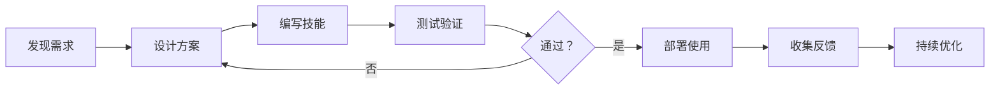

# Phoenix Core 技能开发指南

**版本**: 2.0.0  
**更新日期**: 2026-04-12

---

## 📖 什么是技能

技能是 Phoenix Core 中的核心概念，是可重用的任务执行模式。

**技能格式**:

```markdown
[SKILL] 技能名称
Description: 一句话描述技能用途
Triggers: 触发条件说明
Steps: 1. 第一步 2. 第二步 3. 第三步
Examples: 典型使用场景
```

---

## 🎯 技能来源

### 1. 自动提取

系统会在任务执行后自动评估并提取技能：

```
任务执行 → 4 维评估 → 价值判断 → 技能提取
```

**评估维度**:
- 任务完成度
- 用户满意度
- 步骤数量
- 可复用性

### 2. 手动创建

开发者可以手动创建技能：

```python
from skill_store import SkillStore

store = SkillStore()

skill_content = """[SKILL] 直播方案设计
Description: 为直播平台设计完整的活动方案
Triggers: 用户需要直播活动方案时
Steps: 1. 了解活动目标和预算 2. 确定直播平台和时段 3. 设计互动环节 4. 准备应急预案
Examples: 双 11 直播方案、新品发布会方案
"""

store.add("live_stream_plan", skill_content)
```

---

## 📝 技能结构详解

### Name (名称)

- 简洁明确，反映技能用途
- 使用名词短语
- 避免过于宽泛

**好例子**:
- `直播方案设计`
- `客服问题分类`
- `数据报表生成`

**坏例子**:
- `方案` (太宽泛)
- `处理问题` (不明确)

### Description (描述)

- 一句话描述
- 说明技能用途
- 包含目标用户或场景

**格式**:
```
Description: 为 [目标用户] 提供 [服务内容]，实现 [预期效果]
```

### Triggers (触发条件)

- 明确说明何时使用该技能
- 包含关键词或场景描述

**格式**:
```
Triggers: 当用户 [行为/请求] 时，或提到 [关键词] 时
```

**例子**:
```
Triggers: 用户需要直播活动方案时，或提到"直播"、"活动方案"、"直播策划"时
```

### Steps (步骤)

- 编号步骤，清晰可执行
- 每个步骤独立完整
- 按执行顺序排列

**格式**:
```
Steps: 1. [第一步] 2. [第二步] 3. [第三步]
```

**好例子**:
```
Steps: 1. 了解活动目标和预算 2. 确定直播平台和时段 3. 设计互动环节和流程 4. 准备设备和技术支持 5. 制定应急预案
```

### Examples (示例)

- 提供具体使用场景
- 帮助理解技能适用范围

**格式**:
```
Examples: [场景 1]; [场景 2]; [场景 3]
```

---

## 🔄 技能进化

技能会随着使用不断进化：

```
v1 (初始版本) → v2 (优化) → v3 (完善)
```

### 进化触发条件

1. **失败率过高** (>30%)
2. **用户反馈差**
3. **发现更优方案**

### 版本管理

```python
from skill_evolution import SkillEvolution

evolution = SkillEvolution(memory_manager)

# 进化技能
result = evolution.evolve_skill(
    "memory_config",
    reason="成功率下降",
    execution_data=[...]
)

# 获取历史版本
versions = evolution.get_skill_versions("memory_config")
```

### 回滚到旧版本

```python
# 标记当前版本为废弃
current.deprecated = True
current.deprecated_reason = "效果不佳"

# 恢复旧版本
old_version = versions[-3]  # 获取 v3
```

---

## 🧪 技能测试

### 单元测试

```python
def test_skill_execution():
    """测试技能执行"""
    from skill_executor import SkillExecutor
    
    executor = SkillExecutor()
    result = executor.execute_skill(
        "skill_name",
        context={"user_input": "测试输入"}
    )
    
    assert result is not None
    assert result.get("success") is True
```

### 集成测试

```python
def test_skill_with_memory():
    """测试技能与记忆系统集成"""
    from memory_manager import MemoryManager
    
    manager = MemoryManager()
    manager.load(session_id="test_123")
    
    # 执行需要记忆的技能
    result = manager.handle_tool_call(
        "skill",
        {"action": "execute", "skill": "memory_config"}
    )
    
    assert result is not None
```

---

## 📊 技能评估

### 成功率追踪

```python
from skill_optimizer import SkillOptimizer

optimizer = SkillOptimizer()

# 记录执行结果
optimizer.record_execution({
    "skill_name": "memory_config",
    "success": True,
    "execution_data": {...}
})

# 获取成功率
stats = optimizer.get_skill_stats("memory_config")
print(f"成功率：{stats['success_rate']}")
```

### 效果分析

```python
from skill_comparison import SkillComparator

comparator = SkillComparator()

# 对比不同版本
comparison = comparator.compare_versions(
    "memory_config",
    version_a="v1",
    version_b="v2"
)

print(f"v2 比 v1 成功率提升：{comparison['improvement']}%")
```

---

## 🛠️ 技能开发最佳实践

### 1. 从实际案例出发

不要凭空创造技能，而是从成功的任务执行中提取：

```
成功案例 → 分析步骤 → 提取模式 → 形成技能
```

### 2. 保持技能原子性

每个技能只做一件事，避免过于复杂：

**好**:
- `客服问题分类`
- `客服问题回复`

**坏**:
- `客服问题分类并回复并记录和总结`

### 3. 提供清晰示例

示例帮助理解技能的使用场景：

```markdown
Examples: 
- 用户询问"如何做直播方案"时
- 运营需要双 11 活动策划时
- 渠道部门需要招商方案时
```

### 4. 持续优化

根据执行反馈不断优化：

```python
# 定期分析失败案例
for skill in low_success_skills:
    optimizer.analyze_failure(skill)
    optimizer.optimize_skill(skill)
```

### 5. 版本控制

保留历史版本，支持回滚：

```python
# 获取版本历史
history = evolution.get_evolution_history("skill_name")

# 分析变化趋势
for version in history:
    print(f"{version['version']}: 成功率={version['success_rate']}")
```

---

## 📁 技能文件组织

### 标准格式

```
skills/
├── memory_config.md          # 记忆配置技能
├── live_stream_plan.md       # 直播方案技能
├── customer_service.md       # 客服技能
└── data_analysis.md          # 数据分析技能
```

### 技能命名

- 使用小写字母和下划线
- 名称反映用途
- 避免特殊字符

---

## 🚀 技能开发流程



---

## 📚 相关文档

- [API 参考](API_REFERENCE.md) - SkillStore API
- [最佳实践](BEST_PRACTICES.md) - 技能设计模式
- [故障排除](TROUBLESHOOTING.md) - 常见问题

---

*本文由技术文档工程师 D 撰写*
